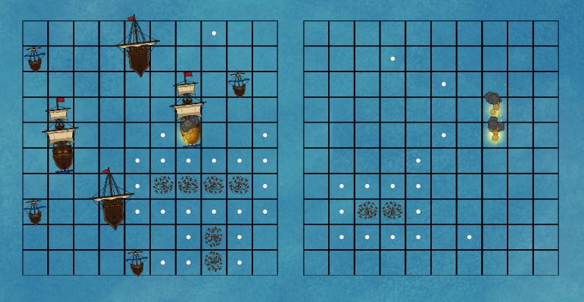

# Морской Бой (Классическая Версия)

## Описание

Классическая игра "Морской бой" против компьютера. Расставьте свои корабли на игровом поле и пытайтесь потопить флот противника, делая выстрелы по его сетке.

## Правила

- Игрок расставляет свой флот: 1 четырехпалубный, 2 трехпалубных, 3 двухпалубных и 4 однопалубных корабля.
- Корабли не могут касаться друг друга ни по сторонам, ни по углам.
- Игроки по очереди совершают выстрелы по клеткам противника.
- Если выстрел попадает в корабль, то он загорается. Если корабль полностью потоплен — на его месте появляются осколки.
- Побеждает тот, кто первым потопит весь флот противника.

## Особенности

- Интуитивно понятный интерфейс с двумя игровыми полями.
- Визуальные эффекты при попадании и потоплении кораблей.
- Идеально подходит для быстрой партии против компьютера.

Удачи на морских просторах!

[**Скачать Windows/Linux**](https://github.com/Zubasty/KeyboardSimulator/releases) 
